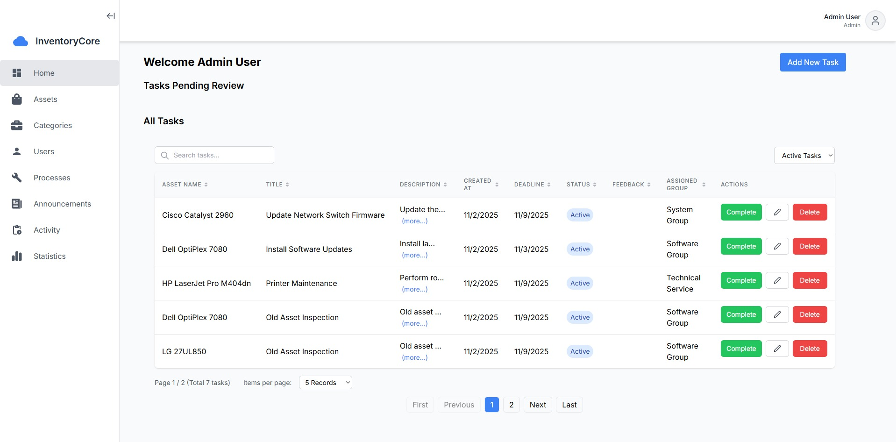
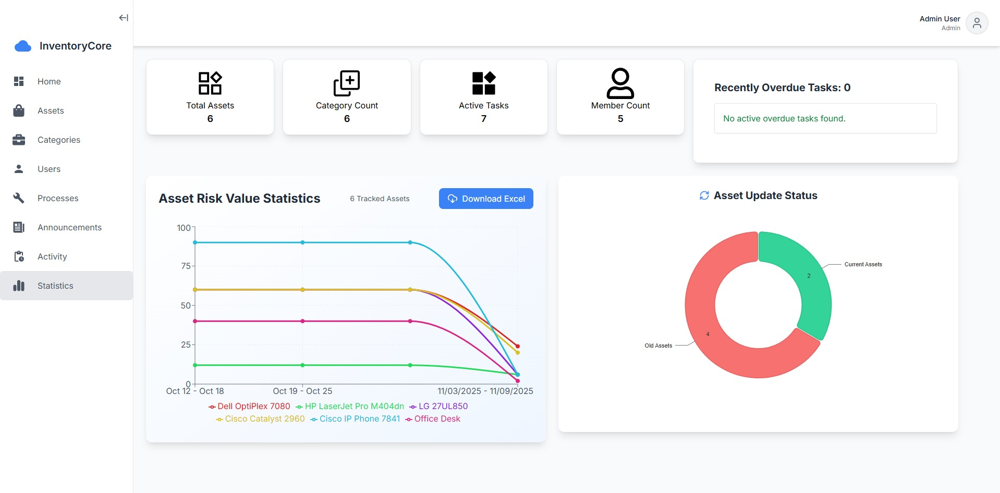
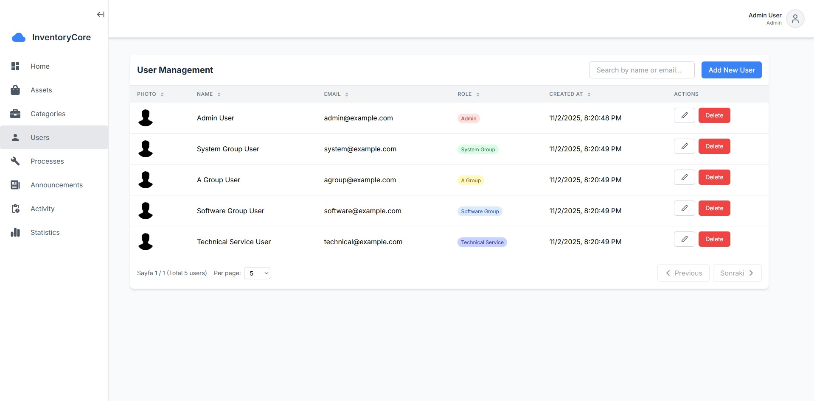

# 🛡️ ISO 27001 Compliant Inventory Management System  

This project is a **dynamic, user-friendly inventory management system** designed in compliance with **ISO 27001 security standards**. Built using the **MERN Stack**, it includes **asset management, task assignment, risk assessment, and role-based access control**.  

---

## 📌 Features  

✅ **Dynamic Asset Management**  
- Three different **groups** (system_group, a_group, software_group).  
- **Custom attributes per category** (add, update, delete dynamically).  

✅ **Dynamic Categories & Attributes:**

- Each category has unique attributes (e.g., Hardware has price, detail attributes; Operating System has version attribute, etc.).

- Product forms adjust dynamically based on the selected category.

✅ **User Roles & Permissions:**

- Admin authentication system.

- Role-based access control.

✅ **Task & Risk Management:**
- Task tracking with risk evaluation.
- **Task Creation:** Admins can create, assign, and track tasks within the system.
- **Group Assignment:** Each task is assigned to a group, and tasks appear on the respective group's homepage.

✅ **Asset Value Tracking:**

- Weekly inventory value calculations.

✅ **Announcements & Notifications:**

- Simple announcement system for users.

✅ **Activity Log:**

- Tracks user actions within the system.

---

## 🛠️ Tech Stack  

| Technology  | Description  |
|------------|-------------|
| **MongoDB** | NoSQL database with dynamic schema support |
| **Express.js** | Backend API development |
| **React.js** | Frontend UI framework |
| **Node.js** | Backend server runtime |
| **Tailwind CSS** | Modern UI styling |
| **JWT** | Secure authentication and session handling |
| **Bcrypt** | Password hashing for security |

---

## 📷 Screenshots From Website

**Main Page**



**Statistics Page**



**User Management Page**



---

## 🚀 Installation & Setup

### Prerequisites
- Node.js installed
- MongoDB installed and running

### 1. Clone the repository
```bash
git clone https://github.com/emrhngngr/InventoryCore.git
cd InventoryCore
```

### 2. Setup Environment Variables

**Server (.env)**
```env
MONGO_URI=mongodb://localhost:27017/inventory-db
JWT_SECRET=your-secret-jwt-key
ADMIN_CREATION_KEY=your-admin-creation-key
EMAIL_USER=your-email@gmail.com
EMAIL_PASS=your-app-password
PORT=5000
```

**Client (.env)**
```env
REACT_APP_API_URL=http://localhost:5000/api
```

### 3. Install Dependencies
```bash
# Install server dependencies
cd server
npm install

# Install client dependencies
cd ../client
npm install
```

### 4. Seed Database
```bash
cd server
npm run seed
```

This will create:
- **Admin user**: admin@example.com / admin123
- **Sample users** for each group (password: 123456)
- **Categories**: Computer, Printer, Monitor, Network Equipment, Phone, Furniture
- **Sample products** and announcements

### 5. Run the Application
```bash
# Start server (from server directory)
npm start

# Start client (from client directory - in another terminal)
npm start
```

The application will run on:
- **Frontend**: http://localhost:3000
- **Backend**: http://localhost:5000

---

